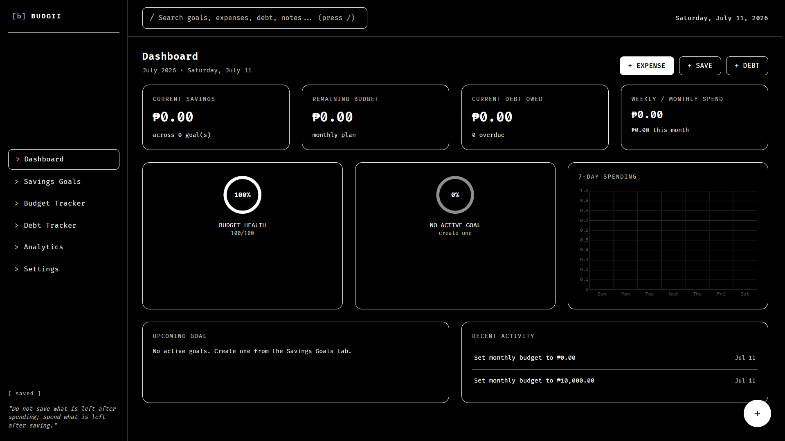

<div align="center">
 
# BUDGII

  **FINANCE // TRACKER // WEB // ASCII ART**



</div>
A local-first personal finance tracker with a Nothing OS-inspired monochrome interface dot-matrix typography, no icons, ASCII art instead. Savings goals, budget tracking, debt tracking, and analytics, all running entirely in the browser with zero backend.

---
## Features

- **Dashboard** — current savings, remaining budget, debt owed, weekly/monthly spend, progress rings, mini chart, upcoming goal, recent activity feed
- **Savings Goals** — unlimited goals with daily/weekly/biweekly/monthly/custom saving schedules, an interactive day/week/month/year calendar for logging contributions (completed / partial / missed / skip), streaks, average contribution, and projected completion dates (including a "what if I keep missing payments" projection)
- **Budget Tracker** — weekly/monthly/yearly/custom budgets, built-in + custom categories, 5 payment methods, category pie chart, weekly bar chart, monthly trend line, budget-vs-actual chart, burn rate, and a budget health score
- **Debt Tracker** — unlimited entries, simple or compound interest at daily/weekly/monthly/yearly frequency, partial payments, payment timeline, overdue detection
- **Analytics** — savings rate, budget accuracy, collection rate, financial health score, contribution heatmap, year-end projections, achievement badges, and auto-generated insights (e.g. "You exceeded your entertainment budget by ₱1,250")
- **Settings** — currency (₱ $ € ¥ £), theme (Dark / Pure Black / High Contrast), font size, JSON export/import, full data reset
- Global search, quick-add floating button, keyboard shortcuts (`/` search, `Q` quick add, `1`–`6` to jump between tabs), undo-on-delete, autosave indicator

## Tech Stack

Plain HTML5, CSS3, and vanilla JavaScript (ES6+) — no framework, no build step, no bundler. Charts are rendered with [Chart.js](https://www.chartjs.org/) loaded from a CDN. All data is stored in the browser's `localStorage`.

## Getting Started

No installation required.

```bash
git clone https://github.com/<your-username>/ascii-budget.git
cd ascii-budget
```

Then just open `index.html` in a browser — double-click it, or run a quick local server if you prefer:

```bash
npx serve .
# or
python3 -m http.server
```

> Charts require an internet connection on first load (Chart.js is pulled from a CDN). Everything else works fully offline, and all your data stays in your browser's local storage — nothing is sent anywhere.

## Project Structure

```
ascii-budget/
├── index.html
├── css/
│   └── style.css        # Nothing OS-inspired monochrome theme
├── js/
│   ├── app.js            # state/storage, navigation, search, modals, toasts, dashboard, analytics, settings
│   ├── calendar.js        # day/week/month/year calendar renderer
│   ├── savings.js        # savings goals, streaks, projections
│   ├── budget.js         # budget config, expenses, stats
│   ├── debt.js            # debt entries, interest, payments
│   └── charts.js          # Chart.js theming helpers
└── assets/
```

## Data & Privacy

Everything is stored in `localStorage` under a single key. Nothing leaves your browser except the one-time CDN fetch for Chart.js. Use **Settings → Export Data** to back up your data as JSON, and **Import Data** to restore it (e.g. after clearing browser storage or moving to a new device).

## Known Limitations

- Interest and streak/projection math uses reasonable but opinionated formulas (e.g. interest accrues continuously based on days elapsed rather than only on scheduled payment dates) — double-check the numbers against your own use case if precision matters.
- No multi-user support or sync; data is local to a single browser.

## License

MIT — do whatever you'd like with it.
